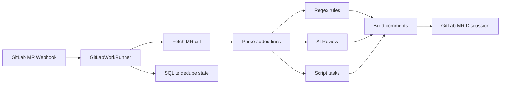
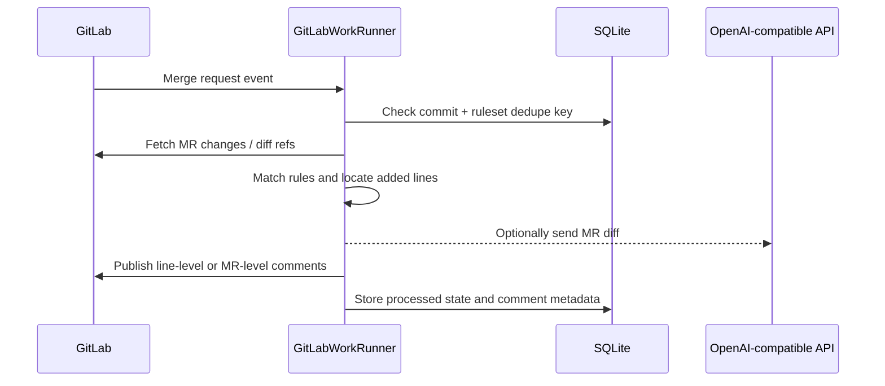

# GitLabWorkRunner

Language: [简体中文](README.md) | **English**

GitLabWorkRunner is a Rust service for automated GitLab Merge Request review. It receives GitLab webhooks, fetches MR changes, runs checks configured in `rules.toml`, and publishes the result back to GitLab MR Discussions.

It is not a GitLab Runner replacement and does not automatically run CI scripts from the target repository. It only runs checks that you explicitly configure.

## How It Works



A normal automatic review looks like this:



See [docs/design.md](docs/design.md) for more design detail.

## Features

- Automatic review from GitLab Merge Request webhooks.
- Line-level comments only on added lines in the MR diff.
- `[[rules]]`: path + regex checks on added lines.
- `[[ai_reviews]]`: OpenAI-compatible `POST /chat/completions` review.
- `[[script_tasks]]`: download the MR head snapshot and run local scripts.
- Manual script task or AI Review triggers from MR comments, such as `@check-todo-tbd` and `@ai-review`.
- SQLite dedupe state to avoid repeating comments for the same commit and ruleset.

## Quick Start

Create local config files:

```powershell
Copy-Item config.example.toml config.toml
Copy-Item rules.example.toml rules.toml
cargo run
```

Linux / macOS:

```bash
cp config.example.toml config.toml
cp rules.example.toml rules.toml
cargo run
```

Add a GitLab project webhook:

1. Open your GitLab project, then go to `Settings` -> `Webhooks`.
2. Set `URL` to the service endpoint:

```text
http://<host>:8080/webhooks/gitlab
```

`<host>` must be reachable from GitLab.

3. Set `Secret token` to the value of `[server].webhook_secret` in `config.toml`:

```toml
[server]
webhook_secret = "change-me"
```

4. Enable `Merge request events`.
5. Enable `Comments` as well if you want manual script task or AI Review triggers from MR comments.
6. After saving, use the `Test` action on the GitLab Webhook page to send a test event.

See [docs/gitlab-webhook.md](docs/gitlab-webhook.md) for webhook behavior details.

## Build

Development build:

```bash
cargo build
```

Release/deployment build:

```bash
cargo build --release
```

Build outputs:

```text
target/debug/gitlab-work-runner.exe      # Windows debug
target/release/gitlab-work-runner.exe    # Windows release
target/debug/gitlab-work-runner          # Linux / macOS debug
target/release/gitlab-work-runner        # Linux / macOS release
```

Before running the binary, still prepare `config.toml` and `rules.toml`.

## Service Config

`config.toml` controls the service, GitLab access, storage, and rules file:

```toml
[server]
bind = "0.0.0.0:8080"
webhook_secret = "change-me"

[gitlab]
base_url = "https://gitlab.example.com"
token = "<your-gitlab-token>"

[storage]
database_url = "sqlite://gitlab-work-runner.db"

[rules]
file = "rules.toml"

```

`[gitlab].token` is the token used by the service when calling the GitLab API. It is different from the webhook `Secret token`. Prefer a Project Access Token or a dedicated bot user token with the `api` scope and at least the `Developer` project role. It must be able to read MR diffs, download repository archives, and publish MR discussions. Do not commit a real `config.toml` token to the repository.

## Rules Config

Minimal `rules.toml` example:

```toml
[[rules]]
auto_enabled = true
id = "forbid-unwrap"
title = "Avoid unwrap"
severity = "warning"
path = "**/*.rs"
pattern = "\\.unwrap\\(\\)"
message = "Direct unwrap can panic at runtime. Prefer explicit error handling."
```

You can define multiple `[[rules]]` entries and distinguish them by `id`. `auto_enabled` defaults to `true`; set it to `false` to exclude the rule from automatic review.

AI Review example:

```toml
[[ai_reviews]]
auto_enabled = false
id = "ai-review"
title = "AI Review"
base_url = "https://api.openai.com/v1"
api_key = "<your-ai-api-key>"
model = "gpt-4.1-mini"
timeout_seconds = 60
max_diff_bytes = 60000
when_changed = ["**/*.rs", "**/*.toml"]
```

`auto_enabled` defaults to `true`; set it to `false` to skip automatic execution while still allowing manual MR comment triggers such as `@ai-review`.

Do not commit a real `rules.toml` that contains an actual `api_key`.

`@ai-review` matches `id = "ai-review"` inside `[[ai_reviews]]`. `[[ai_reviews]]` is the config block type, not the trigger command.

Script task example:

```toml
[[script_tasks]]
auto_enabled = false
id = "check-todo-tbd"
title = "TODO/TBD marker check"
command = "python examples/scripts/check_todo_tbd.py"
timeout_seconds = 30
when_changed = ["**/*.rs"]
```

`auto_enabled` defaults to `true`; set it to `false` to skip automatic execution while still allowing manual MR comment triggers such as `@check-todo-tbd`.

`@check-todo-tbd` matches `id = "check-todo-tbd"` inside `[[script_tasks]]`.

Scripts receive two arguments:

```text
<MR head source directory> <result.txt path>
```

When a script exits with `1`, the service reads `result.txt`. Prefer this format:

```text
src/config.rs:5: //TODO aa
```

## Manual Triggers

After enabling GitLab webhook `Comments`, add standalone commands in an MR comment:

```text
@check-todo-tbd
@ai-review
```

Manual triggers do not use the automatic review dedupe key; every valid command comment runs once.

The current implementation does not perform an extra GitLab role check for the comment author. If a user can comment on the MR and the comment contains a valid `@id`, the service runs the matching manual task. Add a service-side permission check or allowlist if only Maintainers or selected users should be allowed to trigger manual tasks.

## More Docs

- [docs/design.md](docs/design.md): design and module boundaries.
- [docs/gitlab-webhook.md](docs/gitlab-webhook.md): GitLab webhook setup and trigger behavior.
- [rules.example.toml](rules.example.toml): full rules example.
- [examples/scripts/check_todo_tbd.py](examples/scripts/check_todo_tbd.py): script task example.

## License

MIT. See [LICENSE](LICENSE).
