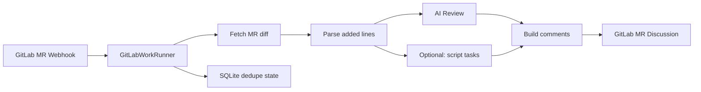
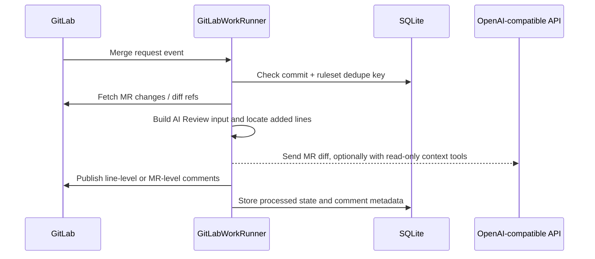

# GitLabWorkRunner

Language: [简体中文](README.md) | **English**

GitLabWorkRunner is a Rust service for automated GitLab Merge Request review. It receives GitLab webhooks, fetches MR changes, runs `[[ai_reviews]]` by default, and publishes the result back to GitLab MR Discussions.

It is not a GitLab Runner replacement and does not automatically run CI scripts from the target repository. The default example enables AI Review configuration and keeps a disabled script task example for later use.

## How It Works



A normal automatic review looks like this:



See [docs/design.md](docs/design.md) for more design detail.

## Features

- Automatic review from GitLab Merge Request webhooks.
- Line-level comments only on added lines in the MR diff.
- `[[ai_reviews]]`: OpenAI-compatible `POST /chat/completions` review.
- Chat Completions `tool_calls` structured output and built-in read-only context tools: `read_file`, `search_code`, and `list_files`.
- Manual AI Review triggers from MR comments, such as `@ai-review`.
- If the same `project_id + mr_iid + commit_sha` is already running, duplicate triggers are skipped. For MR comment triggers, the service awards an `eyes` emoji and posts a comment saying the commit is already being reviewed.
- SQLite dedupe state to avoid repeating automatic comments for the same commit and ruleset.
- Optional capability: `[[script_tasks]]` local script tasks over the MR head snapshot, disabled by default.

## Quick Start

Create local config files:

```powershell
Copy-Item config.example.toml config.toml
Copy-Item rules.example.toml rules.toml
cargo run
```

Linux / macOS:

```bash
cp config.example.toml config.toml
cp rules.example.toml rules.toml
cargo run
```

Add a GitLab project webhook:

1. Open your GitLab project, then go to `Settings` -> `Webhooks`.
2. Set `URL` to the service endpoint:

```text
http://<host>:8080/webhooks/gitlab
```

`<host>` must be reachable from GitLab.

3. Set `Secret token` to the value of `[server].webhook_secret` in `config.toml`:

```toml
[server]
webhook_secret = "change-me"
```

4. Enable `Merge request events`.
5. Enable `Comments` as well if you want manual AI Review triggers from MR comments, such as `@ai-review`.
6. After saving, use the `Test` action on the GitLab Webhook page to send a test event.

See [docs/gitlab-webhook.md](docs/gitlab-webhook.md) for webhook behavior details.

## Build

Development build:

```bash
cargo build
```

Release/deployment build:

```bash
cargo build --release
```

Build outputs:

```text
target/debug/gitlab-work-runner.exe      # Windows debug
target/release/gitlab-work-runner.exe    # Windows release
target/debug/gitlab-work-runner          # Linux / macOS debug
target/release/gitlab-work-runner        # Linux / macOS release
```

Before running the binary, still prepare `config.toml` and `rules.toml`.

## Service Config

`config.toml` controls the service, GitLab access, storage, and rules file:

```toml
[server]
bind = "0.0.0.0:8080"
webhook_secret = "change-me"

[gitlab]
base_url = "https://gitlab.example.com"
token = "<your-gitlab-token>"

[storage]
database_url = "sqlite://gitlab-work-runner.db"

[rules]
file = "rules.toml"

```

`[gitlab].token` is the token used by the service when calling the GitLab API. It is different from the webhook `Secret token`. Prefer a Project Access Token or a dedicated bot user token with the `api` scope and at least the `Developer` project role. It must be able to read MR diffs, download repository archives, and publish MR discussions. Do not commit a real `config.toml` token to the repository.

## AI Review Config

The recommended setup is AI Review-first. `rules.toml` should keep `[ai_review]` and `[[ai_reviews]]`; script tasks can stay configured with `auto_enabled = false` and be enabled or triggered manually later.

Recommended `rules.toml` example:

```toml
[ai_review]
# Optional global AI Review prompt settings shared by every [[ai_reviews]] entry.
# system_prompt = "You are a careful code reviewer. Return only high-confidence bugs."
extra_instructions = """
Focus on compile errors, runtime errors, resource lifetime issues, thread safety, and security bugs.
Do not report style suggestions, naming suggestions, or uncertain issues.
"""
max_tool_calls = 30
max_tool_result_bytes = 60000

[ai_review.context_tools]
read_file = false
search_code = false
list_files = false

[[ai_reviews]]
auto_enabled = false
id = "ai-review"
title = "AI Review"
base_url = "https://api.openai.com/v1"
api_key = "<your-ai-api-key>"
model = "gpt-4.1-mini"
timeout_seconds = 900
request_timeout_seconds = 180
max_diff_bytes = 60000
second_pass_on_clean = false
batch_review = true
max_batch_diff_bytes = 15000
max_batches = 10
when_changed = ["**/*.rs", "**/*.toml", "**/*.c", "**/*.cc", "**/*.cpp", "**/*.h", "**/*.hpp"]
```

`auto_enabled` defaults to `true`; set it to `false` to skip automatic execution while still allowing manual MR comment triggers such as `@ai-review`. The example uses `false`, which fits a comment-driven workflow. Set it to `true` if MR updates should run AI Review automatically.

`[ai_review]` is the global AI Review prompt configuration. `system_prompt` replaces the built-in system prompt; `extra_instructions` is appended to the user prompt. If omitted, the built-in prompt is used.
`[ai_review.context_tools]` configures built-in read-only context tools. They are disabled by default. When enabled, the service downloads the MR head archive and lets the model request `read_file`, `search_code`, or `list_files` through tool calls. The runner only returns text content inside the repository directory; it does not execute shell commands and skips `.env` and `.git`.
`max_tool_calls` defaults to `30`, and `max_tool_result_bytes` defaults to `60000`.
`request_timeout_seconds` is the timeout for one AI API request. If omitted, it defaults to `timeout_seconds / 2` so one retry still fits inside the total review deadline.
`second_pass_on_clean` defaults to `false`; set it to `true` to run one confirmation pass when the first AI Review finds nothing.
AI Review requests Chat Completions `tool_calls` structured output by default and parses findings from `submit_review_findings` arguments. If no tool call is returned, it falls back to parsing JSON in `content`. Built-in context tools do not require MCP.
`batch_review` defaults to `false`; set it to `true` to split large MR diffs by complete file diffs. `max_batch_diff_bytes` controls the per-batch diff byte limit, and `max_batches` controls the maximum number of AI requests.

Do not commit a real `rules.toml` that contains an actual `api_key`.

`@ai-review` matches `id = "ai-review"` inside `[[ai_reviews]]`. `[[ai_reviews]]` is the config block type, not the trigger command.

### Optional: Script Tasks

Script tasks are still supported, but disabled by default. Keep the config now and enable it later when you need deterministic local checks:

```toml
[[script_tasks]]
auto_enabled = false
id = "check-todo-tbd"
title = "TODO/TBD marker check"
command = "python examples/scripts/check_todo_tbd.py"
timeout_seconds = 30
when_changed = ["**/*.rs"]
```

`auto_enabled` defaults to `true`; set it to `false` to skip automatic execution while still allowing manual MR comment triggers such as `@check-todo-tbd`.

`@check-todo-tbd` matches `id = "check-todo-tbd"` inside `[[script_tasks]]`.

Scripts receive two arguments:

```text
<MR head source directory> <result.txt path>
```

When a script exits with `1`, the service reads `result.txt`. Prefer this format:

```text
src/config.rs:5: //TODO aa
```

## Manual Triggers

After enabling GitLab webhook `Comments`, add standalone commands in an MR comment:

```text
@ai-review
```

Manual triggers do not use the completed automatic review dedupe key. The same commit can be triggered again after the current run finishes. If the same `project_id + mr_iid + commit_sha` is still running, a new trigger is skipped; the service awards `eyes` to the triggering note and posts an MR comment asking the user to retry later.

If optional script tasks are configured, they can also be triggered by their id:

```text
@check-todo-tbd
```

The current implementation does not perform an extra GitLab role check for the comment author. If a user can comment on the MR and the comment contains a valid `@id`, the service runs the matching manual task. Add a service-side permission check or allowlist if only Maintainers or selected users should be allowed to trigger manual tasks.

## Work Directory Cleanup

Downloaded GitLab archive zip bytes stay in memory; the service does not write the zip file to disk. When repository context is needed, the archive is extracted under `work/`:

- AI context tools: `work/ai_review_context/.../<review_run_id>/source`
- Script tasks: `work/script_tasks/.../<task_id>/source`

After normal completion or failure, AI Review removes the current context run directory. Script tasks remove `source` but keep `run.log` and `result.txt` for troubleshooting. On startup, the service cleans stale work directories older than 24 hours, and it repeats that cleanup every hour while running. Cleanup failures are logged as WARN and do not block review.

The active-review guard is process-local. For multi-instance deployments, move the running lock to SQLite/PostgreSQL if cross-process exclusion and global cleanup are required.

## Failure Notifications

If the whole review run fails with a non-recoverable error, such as fetching MR diff, downloading the archive, calling the GitLab API, or internal processing failure, the service posts an MR-level failure comment. The comment includes `commit`, `review_run_id`, and a truncated error summary. If posting the failure notification fails, the runner only logs WARN and does not retry.

## More Docs

- [docs/design.md](docs/design.md): design and module boundaries.
- [docs/gitlab-webhook.md](docs/gitlab-webhook.md): GitLab webhook setup and trigger behavior.
- [rules.example.toml](rules.example.toml): full rules example.
- [examples/scripts/check_todo_tbd.py](examples/scripts/check_todo_tbd.py): optional script task example.

## License

MIT. See [LICENSE](LICENSE).
