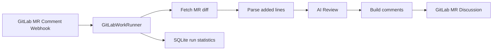
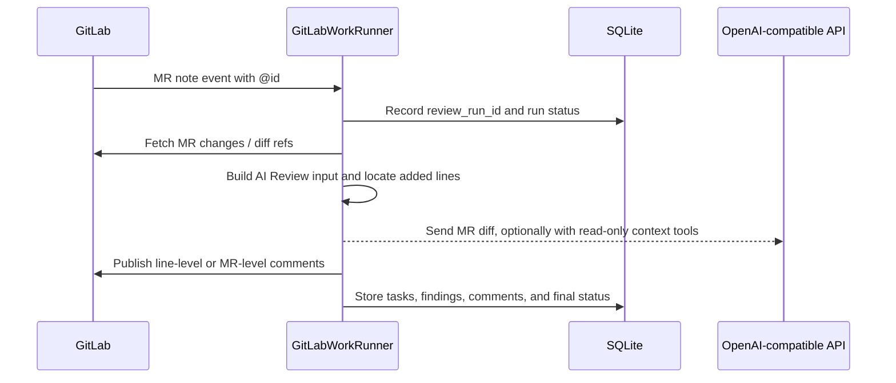

# GitLabWorkRunner

Language: [简体中文](README.md) | **English**

GitLabWorkRunner is a Rust service for manual GitLab Merge Request review. It is triggered by GitLab MR comments, fetches MR changes, runs `[[ai_reviews]]`, and publishes the result back to GitLab MR Discussions.

It is not a GitLab Runner replacement and does not run CI scripts from the target repository. The current service runs AI Review only.

## How It Works



A manual review request looks like this:



See [docs/design.md](docs/design.md) for more design detail.

## Features

- Manual review from GitLab Merge Request Note webhooks.
- Line-level comments only on added lines in the MR diff.
- `[[ai_reviews]]`: OpenAI-compatible `POST /chat/completions` review.
- Chat Completions `tool_calls` structured output and built-in read-only context tools: `read_file`, `search_code`, and `list_files`.
- Manual AI Review triggers from MR comments, such as `@ai-review`.
- If the same `project_id + mr_iid + commit_sha` is already running, duplicate triggers are skipped. For MR comment triggers, the service awards an `eyes` emoji and posts a comment saying the commit is already being reviewed.
- Each review run, subtask, finding, and published comment is written to structured SQLite tables with RFC3339 UTC timestamps.

## Quick Start

Create local config files:

```powershell
Copy-Item config.example.toml config.toml
Copy-Item rules.example.toml rules.toml
cargo run
```

Linux / macOS:

```bash
cp config.example.toml config.toml
cp rules.example.toml rules.toml
cargo run
```

Add a GitLab project webhook:

1. Open your GitLab project, then go to `Settings` -> `Webhooks`.
2. Set `URL` to the service endpoint:

```text
http://<host>:8080/webhooks/gitlab
```

`<host>` must be reachable from GitLab.

3. Set `Secret token` to the value of `[server].webhook_secret` in `config.toml`:

```toml
[server]
webhook_secret = "change-me"
```

4. Enable `Merge request events`.
5. Enable `Comments` as well if you want manual AI Review triggers from MR comments, such as `@ai-review`.
6. After saving, use the `Test` action on the GitLab Webhook page to send a test event.

See [docs/gitlab-webhook.md](docs/gitlab-webhook.md) for webhook behavior details.

## Build

Development build:

```bash
cargo build
```

Release/deployment build:

```bash
cargo build --release
```

Build outputs:

```text
target/debug/gitlab-work-runner.exe      # Windows debug
target/release/gitlab-work-runner.exe    # Windows release
target/debug/gitlab-work-runner          # Linux / macOS debug
target/release/gitlab-work-runner        # Linux / macOS release
```

Before running the binary, still prepare `config.toml` and `rules.toml`.

Run in the background on Linux:

```bash
cargo build --release
./scripts/linux-background.sh start
./scripts/linux-background.sh status
```

Stop or restart:

```bash
./scripts/linux-background.sh stop
./scripts/linux-background.sh restart
```

The script manages runner and Dashboard together by default, runs from the project root, writes pid files to `run/`, and appends stdout/stderr to `logs/`. To manage one service only:

```bash
./scripts/linux-background.sh start runner
./scripts/linux-background.sh start dashboard
```

## Service Config

`config.toml` controls the service, GitLab access, storage, and rules file:

```toml
[server]
bind = "0.0.0.0:8080"
webhook_secret = "change-me"
max_concurrent_reviews = 4

[gitlab]
base_url = "https://gitlab.example.com"
token = "<your-gitlab-token>"
api_timeout_seconds = 30
archive_timeout_seconds = 300

[storage]
database_url = "sqlite://gitlab-work-runner.db"

[rules]
file = "rules.toml"

[archive]
max_archive_bytes = 104857600      # 100 MiB
max_extracted_files = 10000        # 10,000 files
max_extracted_bytes = 209715200    # 200 MiB
max_single_file_bytes = 10485760   # 10 MiB
max_entry_path_bytes = 512         # 512 bytes

```

`[gitlab].token` is the token used by the service when calling the GitLab API. It is different from the webhook `Secret token`. Prefer a Project Access Token or a dedicated bot user token with the `api` scope and at least the `Developer` project role. It must be able to read MR diffs, download repository archives, and publish MR discussions. Do not commit a real `config.toml` token to the repository. `api_timeout_seconds` controls regular GitLab API request timeouts, and `archive_timeout_seconds` separately controls repository archive download timeouts. Both default to `30` seconds.

`[server].max_concurrent_reviews` controls how many review runs can execute at the same time in one process. The default is `4`. When the limit is reached, the runner does not start another background review and posts an MR-level comment asking the user to retry later because the review queue is busy. If the request came from an MR note, the service also awards `eyes` to the triggering note.

`[archive]` controls safety limits for downloading and extracting GitLab repository archives. If any configured limit is exceeded during AI archive download or extraction (`max_archive_bytes`, `max_extracted_files`, `max_extracted_bytes`, `max_single_file_bytes`, or `max_entry_path_bytes`), the service logs WARN and continues the AI Review with MR diff only. In that fallback, `read_file`, `search_code`, and `list_files` are unavailable, and no `archive_limit_exceeded` failure notification is posted. Archives within the limits are extracted normally and enable the read-only context tools. Non-limit failures—including timeout, permission, HTTP, corrupt ZIP, and filesystem errors—still fail the review through the existing failure path. Depending on the repository, either tune the limits or retain the safety boundary and accept diff-only review; increasing size limits is not the only supported response.

## Dashboard

The dashboard is a separate binary and does not share the webhook runner's HTTP port. The runner writes SQLite statistics tables, and the dashboard reads the same database in read-only workflows.

By default it reads the same `config.toml`: `[storage].database_url` selects the SQLite database, and `[dashboard].bind` selects the dashboard HTTP bind address. If no `config.toml` is provided, it falls back to local defaults: listen on `127.0.0.1:8082` and read `gitlab-work-runner.db` in the current directory.

Config example:

```toml
[storage]
database_url = "sqlite://gitlab-work-runner.db"

[dashboard]
bind = "127.0.0.1:8082"
```

Start:

```powershell
.\gitlab-work-runner-dashboard.exe
```

Open:

```text
http://127.0.0.1:8082/dashboard
```

API:

```text
GET /api/summary
GET /api/finding-summary
GET /api/runs
GET /api/runs?status=failed&project=group/project&mr_iid=2
GET /api/runs/<review_run_id>
GET /api/projects
GET /api/merge-requests
GET /api/findings
GET /api/comments
```

The dashboard process does not run migrations. If the database or statistics tables do not exist, start `gitlab-work-runner.exe` once first to run migrations.

## AI Review Config

Only manual MR comment-triggered reviews are currently supported. MR update events are accepted and ignored instead of entering the review queue. Keep `[ai_review]` and `[[ai_reviews]]` in `rules.toml`. When upgrading, remove every `[[script_tasks]]` block: configuration parsing is strict, so leaving these blocks in place causes the configuration to be rejected.

Recommended `rules.toml` example:

```toml
[ai_review]
# Optional global AI Review prompt settings shared by every [[ai_reviews]] entry.
# The built-in system prompt always applies; extra_instructions is appended to the system prompt as administrator review policy.
extra_instructions = ""
max_tool_calls = 30
max_tool_result_bytes = 60000

[[ai_reviews]]
id = "ai-review"
title = "AI Review"
base_url = "https://api.openai.com/v1"
api_key = "<your-ai-api-key>"
model = "gpt-4.1-mini"
timeout_seconds = 1200
request_timeout_seconds = 420
second_pass_on_clean = false
max_batch_diff_bytes = 15000
max_batches = 10
```

Posting a standalone `@ai-review` in an MR comment triggers the entry whose `id = "ai-review"`. MR update events are accepted and ignored; they do not enter the review queue.

`[ai_review]` is the global AI Review prompt configuration. The built-in system prompt always applies; `extra_instructions` is appended to the system prompt as administrator review policy. If omitted, only the built-in prompt is used.
Text after `@ai-review` in an MR comment is passed only as a reviewer-provided scope preference, such as adding focus areas, skipping optional categories, or limiting files/directories. It cannot override the output protocol, safety rules, tool permissions, or high-confidence threshold.
Built-in read-only context tools are enabled by default. The service downloads the MR head archive and lets the model request `read_file`, `search_code`, or `list_files` through tool calls. The runner only returns text content inside the repository directory; it does not execute shell commands and skips `.env` and `.git`.
`max_tool_calls` defaults to `30`; `0` means unlimited tool calls. `max_tool_result_bytes` defaults to `60000`.
Logs include each tool call's tool name, argument summary, returned bytes, result truncation status, tool-call limit status, batch index/count, and cumulative tool-call count. This makes it clear whether the model actually called `read_file`, `search_code`, or `list_files`.
`request_timeout_seconds` is the timeout for one AI API request. If omitted, it defaults to `timeout_seconds / 2` so one retry still fits inside the total review deadline.
`second_pass_on_clean` defaults to `false`; set it to `true` to run one confirmation pass when the first AI Review finds nothing. The confirmation pass reuses the same prepared archive context; if an archive safety limit caused diff-only fallback, it reuses that same fallback.
AI Review requests Chat Completions `tool_calls` structured output by default and parses findings from `submit_review_findings` arguments. If no tool call is returned, it falls back to parsing JSON in `content`. Built-in context tools do not require MCP.
AI Review splits MR diffs by complete file diffs by default. `max_batch_diff_bytes` controls the per-batch diff byte limit, and `max_batches` controls the maximum number of AI requests; `0` means unlimited batches.

The runner scans all MR changes and stores file counts, raw diff byte counts, and required/planned/completed batch counts in SQLite. Files omitted by `max_batches` and files partially reviewed because a single diff exceeded the batch limit appear in Dashboard run details. Coverage is never added to GitLab comments.

Do not commit a real `rules.toml` that contains an actual `api_key`.

`@ai-review` matches `id = "ai-review"` inside `[[ai_reviews]]`. `[[ai_reviews]]` is the config block type, not the trigger command.

## Manual Triggers

After enabling GitLab webhook `Comments`, add standalone commands in an MR comment:

```text
@ai-review
```

The same commit can be triggered again after the current run finishes. If the same `project_id + mr_iid + commit_sha` is still running, a new trigger is skipped; the service awards `eyes` to the triggering note and posts an MR comment asking the user to retry later. If the global number of running reviews has reached `[server].max_concurrent_reviews`, the trigger is also skipped and the MR receives a queue-busy comment.

The current implementation does not perform an extra GitLab role check for the comment author. If a user can comment on the MR and the comment contains a valid `[[ai_reviews]].id`, the service runs the matching AI Review. Add a service-side permission check or allowlist if only Maintainers or selected users should be allowed to trigger reviews.

## Work Directory Cleanup

Downloaded GitLab archive zip bytes stay in memory; the service does not write the zip file to disk. When repository context is needed, the archive is extracted under `work/`:

- AI context tools: `work/ai_review_context/.../<review_run_id>/source`

After normal completion or failure, AI Review removes the current context run directory. On startup, the service cleans stale work directories older than 24 hours, and it repeats that cleanup every hour while running. Cleanup failures are logged as WARN and do not block review.

The active-review guard and global concurrency limit are process-local. For multi-instance deployments, move the running lock to SQLite/PostgreSQL if cross-process exclusion, global concurrency limiting, and global cleanup are required.

## Failure Notifications

If the whole review run fails with a non-recoverable error, such as fetching MR diff, an archive timeout/permission/HTTP/corrupt-ZIP/filesystem error, calling the GitLab API, or internal processing failure, the service posts an MR-level failure comment. Archive safety limits instead produce WARN and diff-only fallback. The comment includes `commit`, `review_run_id`, and a truncated error summary. If posting the failure notification fails, the runner only logs WARN and does not retry.

If one AI review subtask fails while other AI reviews can continue, the service posts an MR-level "partial AI Review failure" summary before the run finishes. The comment lists failed `ai_review.id/title` values and includes `commit` and `review_run_id`, with a note to inspect runner logs.

## More Docs

- [docs/design.md](docs/design.md): design and module boundaries.
- [docs/gitlab-webhook.md](docs/gitlab-webhook.md): GitLab webhook setup and trigger behavior.
- [rules.example.toml](rules.example.toml): full rules example.

## License

MIT. See [LICENSE](LICENSE).
