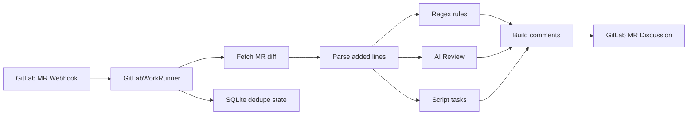
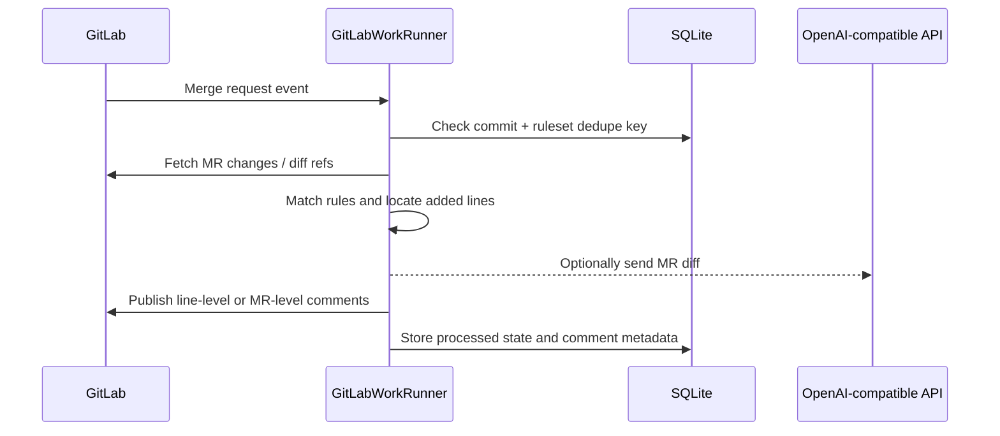

# GitLabWorkRunner

Language: [简体中文](README.md) | **English**

GitLabWorkRunner is a Rust service for automated GitLab Merge Request review. It receives GitLab webhooks, fetches MR changes, runs checks configured in `rules.toml`, and publishes the result back to GitLab MR Discussions.

It is not a GitLab Runner replacement and does not automatically run CI scripts from the target repository. It only runs checks that you explicitly configure.

## How It Works



A normal automatic review looks like this:



See [docs/design.md](docs/design.md) for more design detail.

## Features

- Automatic review from GitLab Merge Request webhooks.
- Line-level comments only on added lines in the MR diff.
- `[[rules]]`: path + regex checks on added lines.
- `[[ai_reviews]]`: OpenAI-compatible `POST /chat/completions` review.
- `[[script_tasks]]`: download the MR head snapshot and run local scripts.
- Manual script task or AI Review triggers from MR comments, such as `@check-todo-tbd` and `@ai-review`.
- SQLite dedupe state to avoid repeating comments for the same commit and ruleset.
- stdout + file logging with built-in size-based rotation.

## Quick Start

Create local config files:

```powershell
Copy-Item config.example.toml config.toml
Copy-Item rules.example.toml rules.toml
$env:GITLAB_TOKEN = "<your-gitlab-token>"
cargo run
```

Linux / macOS:

```bash
cp config.example.toml config.toml
cp rules.example.toml rules.toml
export GITLAB_TOKEN="<your-gitlab-token>"
cargo run
```

Add a GitLab project webhook:

```text
URL: http://<host>:8080/webhooks/gitlab
Secret token: value from [server].webhook_secret in config.toml
Trigger: Merge request events
```

Enable `Comments` as well if you want manual script task or AI Review triggers from MR comments. See [docs/gitlab-webhook.md](docs/gitlab-webhook.md) for webhook details.

## Service Config

`config.toml` controls the service, GitLab access, storage, rules file, and logs:

```toml
[server]
bind = "0.0.0.0:8080"
webhook_secret = "change-me"

[gitlab]
base_url = "https://gitlab.example.com"
token_env = "GITLAB_TOKEN"

[storage]
database_url = "sqlite://gitlab-work-runner.db"

[rules]
file = "rules.toml"

[logging]
file = "logs/gitlab-work-runner.log"
max_bytes = 10485760
max_files = 5
```

`GITLAB_TOKEN` must be able to read MR diffs and publish discussions.

## Rules Config

Minimal `rules.toml` example:

```toml
[[rules]]
id = "forbid-unwrap"
title = "Avoid unwrap"
severity = "warning"
path = "**/*.rs"
pattern = "\\.unwrap\\(\\)"
message = "Direct unwrap can panic at runtime. Prefer explicit error handling."
```

AI Review example:

```toml
[[ai_reviews]]
enabled = false
id = "ai-review"
title = "AI Review"
provider = "openai-compatible"
base_url = "https://api.openai.com/v1"
api_key_env = "OPENAI_API_KEY"
model = "gpt-4.1-mini"
trigger = "auto_and_manual"
timeout_seconds = 60
max_diff_bytes = 60000
when_changed = ["**/*.rs", "**/*.toml"]
```

Script task example:

```toml
[[script_tasks]]
enabled = false
id = "check-todo-tbd"
title = "TODO/TBD marker check"
command = "python examples/scripts/check_todo_tbd.py"
timeout_seconds = 30
when_changed = ["**/*.rs"]
```

Scripts receive two arguments:

```text
<MR head source directory> <result.txt path>
```

When a script exits with `1`, the service reads `result.txt`. Prefer this format:

```text
src/config.rs:5: //TODO aa
```

## Manual Triggers

After enabling GitLab webhook `Comments`, add standalone commands in an MR comment:

```text
@check-todo-tbd
@ai-review
```

Manual triggers do not use the automatic review dedupe key; every valid command comment runs once.

## Logs

Default log config:

```toml
[logging]
file = "logs/gitlab-work-runner.log"
max_bytes = 10485760
max_files = 5
```

Set `RUST_LOG` to control verbosity:

```powershell
$env:RUST_LOG = "info"
```

GitLab tokens, webhook secrets, and AI tokens are not logged.

## More Docs

- [docs/design.md](docs/design.md): design and module boundaries.
- [docs/gitlab-webhook.md](docs/gitlab-webhook.md): GitLab webhook setup and trigger behavior.
- [rules.example.toml](rules.example.toml): full rules example.
- [examples/scripts/check_todo_tbd.py](examples/scripts/check_todo_tbd.py): script task example.

## License

MIT. See [LICENSE](LICENSE).
