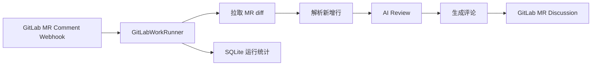
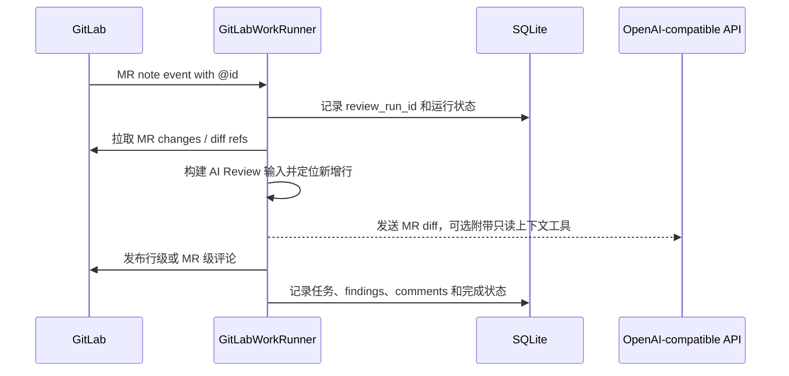

# GitLabWorkRunner

语言：**简体中文** | [English](README.en.md)

GitLabWorkRunner 是一个 Rust 编写的 GitLab Merge Request 手动 Review 服务。它通过 GitLab MR 评论触发 `[[ai_reviews]]`，获取 MR 变更后把结果发布到 MR Discussion。

它不是 GitLab Runner 替代品，也不会执行目标仓库里的 CI 脚本；当前只执行 AI Review。

## 工作原理



手动 Review 的一次请求大致是：



更多设计细节见 [docs/design.md](docs/design.md)。

## 支持能力

- GitLab Merge Request Note Webhook 手动触发 Review。
- 只对 MR diff 的新增行发布行级评论。
- `[[ai_reviews]]`：调用 OpenAI-compatible `POST /chat/completions` 做 AI Review。
- 支持 Chat Completions `tool_calls` 结构化输出，以及内置只读上下文工具 `read_file`、`search_code`、`list_files`。
- MR 评论手动触发 AI Review，例如 `@ai-review`。
- 同一个 `project_id + mr_iid + commit_sha` 正在执行 review 时，会拦截重复触发；如果是 MR 评论触发，会给评论加 `eyes` 并回复“当前 commit 已有 review 正在执行”。
- 每次 review run、子任务、finding 和已发布评论都会写入 SQLite 结构化表，时间字段使用 RFC3339 UTC 字符串。

## 快速开始

准备配置文件：

```powershell
Copy-Item config.example.toml config.toml
Copy-Item rules.example.toml rules.toml
cargo run
```

Linux / macOS：

```bash
cp config.example.toml config.toml
cp rules.example.toml rules.toml
cargo run
```

在 GitLab 项目中添加 Webhook：

1. 进入 GitLab 项目，打开 `Settings` -> `Webhooks`。
2. `URL` 填写服务地址：

```text
http://<host>:8080/webhooks/gitlab
```

其中 `<host>` 是 GitLab 能访问到的 GitLabWorkRunner 地址。

3. `Secret token` 填写 `config.toml` 中 `[server].webhook_secret` 的值：

```toml
[server]
webhook_secret = "change-me"
```

4. 勾选 `Merge request events`。
5. 如果需要在 MR 评论里用 `@ai-review` 手动触发 AI Review，同时勾选 `Comments`。
6. 保存后可以使用 GitLab Webhook 页面里的 `Test` 功能发送测试事件。

Webhook 行为说明见 [docs/gitlab-webhook.md](docs/gitlab-webhook.md)。

## 构建

开发构建：

```bash
cargo build
```

发布/部署构建：

```bash
cargo build --release
```

构建产物：

```text
target/debug/gitlab-work-runner.exe      # Windows debug
target/release/gitlab-work-runner.exe    # Windows release
target/debug/gitlab-work-runner          # Linux / macOS debug
target/release/gitlab-work-runner        # Linux / macOS release
```

运行前仍需要准备 `config.toml` 和 `rules.toml`。

Linux 后台运行：

```bash
cargo build --release
./scripts/linux-background.sh start
./scripts/linux-background.sh status
```

停止或重启：

```bash
./scripts/linux-background.sh stop
./scripts/linux-background.sh restart
```

脚本默认同时管理 runner 和 Dashboard，在项目根目录运行，pid 写入 `run/`，stdout/stderr 追加到 `logs/`。如果只需要管理单个服务：

```bash
./scripts/linux-background.sh start runner
./scripts/linux-background.sh start dashboard
```

Linux 发布包会包含同一个 `scripts/linux-background.sh`；在解压目录内执行时，脚本会优先使用当前目录下的 `gitlab-work-runner` 和 `gitlab-work-runner-dashboard`，源码目录中则回退到 `target/release/`。

## 服务配置

`config.toml` 控制服务、GitLab、存储和规则文件：

```toml
[server]
bind = "0.0.0.0:8080"
webhook_secret = "change-me"
max_concurrent_reviews = 4

[gitlab]
base_url = "https://gitlab.example.com"
token = "<your-gitlab-token>"
api_timeout_seconds = 30
archive_timeout_seconds = 300

[storage]
database_url = "sqlite://gitlab-work-runner.db"

[rules]
file = "rules.toml"

[archive]
max_archive_bytes = 104857600      # 100 MiB
max_extracted_files = 10000        # 10,000 entries（目录和普通文件）
max_extracted_bytes = 209715200    # 200 MiB
max_single_file_bytes = 10485760   # 10 MiB
max_entry_path_bytes = 512         # 512 bytes

```

`[gitlab].token` 是服务调用 GitLab API 使用的 token，和 Webhook 里的 `Secret token` 不是同一个东西。建议使用 Project Access Token 或专用 Bot 用户 token，scope 使用 `api`，项目角色至少 `Developer`。它需要能读取 MR diff、下载仓库 archive，并发布 MR discussion。不要把包含真实 token 的 `config.toml` 提交到仓库。`api_timeout_seconds` 控制普通 GitLab API 请求超时，`archive_timeout_seconds` 单独控制 repository archive 下载超时；两者默认都是 `30` 秒。

`[server].max_concurrent_reviews` 控制单进程内最多同时执行多少个 review run，默认 `4`。达到上限时不会启动新的后台 review，并会发布一条 MR 级评论提示当前 review 队列繁忙，请稍后再试；如果是 MR 评论手动触发，服务还会给触发评论加 `eyes`。

`[archive]` 控制 GitLab repository archive 的下载和解压安全限制。AI Review 下载或解压 archive 时，只要超过任一已配置的限制（`max_archive_bytes`、`max_extracted_files`、`max_extracted_bytes`、`max_single_file_bytes` 或 `max_entry_path_bytes`），服务就会记录 WARN，并使用仅包含 MR diff 的输入继续本次 AI Review；此时不会提供 `read_file`、`search_code` 或 `list_files`，也不会发送 `archive_limit_exceeded` 失败通知。未触发限制的 archive 仍会正常解压并启用这些只读上下文工具。超时、权限、HTTP、损坏 ZIP、文件系统等非限制错误仍会让 review 失败并走现有失败通知。遇到限制时可按仓库情况调整限制，也可以保留默认安全边界并接受 diff-only review，无需把增大限制作为唯一方案。

## Dashboard

Dashboard 是独立二进制，不和 webhook runner 共用 HTTP 端口。runner 负责写 SQLite 统计表，dashboard 只读同一个数据库。

它默认读取同一个 `config.toml`：`[storage].database_url` 决定读取哪个 SQLite 数据库，`[dashboard].bind` 决定 dashboard HTTP 监听地址。不提供 `config.toml` 时会退回到本地默认值：监听 `127.0.0.1:8082`，读取当前目录的 `gitlab-work-runner.db`。

配置示例：

```toml
[storage]
database_url = "sqlite://gitlab-work-runner.db"

[dashboard]
bind = "127.0.0.1:8082"
```

启动：

```powershell
.\gitlab-work-runner-dashboard.exe
```

访问：

```text
http://127.0.0.1:8082/dashboard
```

API：

```text
GET /api/summary
GET /api/finding-summary
GET /api/runs
GET /api/runs?status=failed&project=group/project&mr_iid=2
GET /api/runs/<review_run_id>
GET /api/projects
GET /api/merge-requests
GET /api/findings
GET /api/comments
```

dashboard 进程不会执行 migration。如果数据库或统计表不存在，先启动一次 `gitlab-work-runner.exe` 完成迁移。

## AI Review 配置

当前只支持在 MR 评论里手动触发 review，不再支持 MR 更新后自动筛选执行。`rules.toml` 里需要保留 `[ai_review]` 和 `[[ai_reviews]]`。升级时请删除所有 `[[script_tasks]]` 配置块；配置解析是严格模式，保留这些块会导致配置被拒绝。

推荐 `rules.toml` 示例：

```toml
[ai_review]
# 可选：全局 AI Review prompt 配置，所有 [[ai_reviews]] 共用。
# 内置 system prompt 始终生效；extra_instructions 会作为管理员配置的审查策略追加到 system prompt。
extra_instructions = ""
max_tool_rounds = 0
max_tool_calls = 30
max_tool_result_bytes = 60000
max_tool_total_bytes = 40000

[[ai_reviews]]
id = "ai-review"
title = "AI Review"
base_url = "https://api.openai.com/v1"
api_key = "<your-ai-api-key>"
model = "gpt-4.1-mini"
timeout_seconds = 1200
request_timeout_seconds = 300
max_batch_diff_bytes = 15000
max_batches = 10
```

在 MR 评论中发送独立的 `@ai-review` 会触发 `id = "ai-review"` 的配置。MR 更新事件会被接收并忽略，不会进入 review 队列。
`[ai_review]` 是全局 AI Review prompt 配置：内置 system prompt 始终生效，`extra_instructions` 会作为管理员配置的审查策略追加到 system prompt。缺省时只使用内置 prompt，不需要配置。
`@ai-review` 后面的评论内容只会作为触发者提供的审查范围偏好传给模型，例如增加关注方向、跳过可选检查类别或限定文件目录；它不能覆盖输出协议、安全规则、工具权限或高置信度门槛。
内置只读上下文工具默认启用。服务会下载 MR head archive，让模型可以通过 tool call 请求 `read_file`、`search_code` 或 `list_files`；runner 只返回仓库目录内的文本内容，不执行 shell，也不会读取 `.env` 或 `.git`。
`max_tool_rounds` 默认是 `0`，表示不限制工具往返轮次；设置为非 0 时，会限制每个批次最多进行几轮“模型请求上下文工具 -> runner 返回工具结果”的往返。达到最后一轮后，runner 会执行该轮允许的工具调用，然后移除 `read_file`、`search_code` 和 `list_files`，只保留 `submit_review_findings` 并要求模型立即提交结果；如果模型仍继续请求上下文工具，runner 会丢弃上下文工具对话历史并重试一次干净的 diff-only finalization。
`max_tool_calls` 默认是 `30`，`0` 表示不限制工具调用次数；`max_tool_result_bytes` 默认是 `60000`，限制单次工具结果；`max_tool_total_bytes` 默认是 `40000`，限制每个批次累计返回给模型的上下文工具结果，`0` 表示不限制累计字节数。
完全相同的工具调用会返回紧凑缓存引用，不会再次消耗调用次数或累计字节预算；由于重复调用不会产生新证据，缓存命中后 runner 会立即进入收尾模式。缓存命中、轮次耗尽、调用次数耗尽或累计字节预算耗尽后，runner 会移除上下文工具并要求模型提交最终结果。
日志会记录每次工具调用的工具名、参数摘要、返回 bytes、结果是否截断、是否命中缓存或预算上限、batch index/count、累计 tool round、累计 tool call 次数和累计结果 bytes，便于确认模型是否真的调用了 `read_file`、`search_code` 或 `list_files`。
`request_timeout_seconds` 是单次 AI API 请求的超时；不配置时默认使用 `timeout_seconds / 2`，用于保留一次失败重试机会。
部署时应确保 `request_timeout_seconds` 小于上游负载均衡器或 API 网关的超时。上下文 follow-up 返回 504 或请求超时时，runner 的一次重试会移除上下文工具并强制提交最终结果，而不是原样重发探索请求；如果该收尾请求仍返回 504，则归类为 `ai_tool_loop_timeout` 并进入现有的 diff-only fallback。
`timeout_seconds` 是每次 AI Review 执行的完整预算。带上下文的执行只有在返回 `review_run_timeout`、`ai_request_timeout` 或 `ai_tool_loop_timeout` 时，才会启动一次新的、独立计时的 diff-only fallback；fallback 继续使用相同的 `timeout_seconds`、`request_timeout_seconds`、分批策略和 `max_batches`，但不提供上下文工具，也不会递归启动第三次执行。最坏耗时可能接近 `2 × timeout_seconds`，并另加少量 archive 准备、清理和发布开销；该行为不新增配置项。其他 AI 错误以及 archive 超时、权限、HTTP、损坏 ZIP、文件系统等错误不符合此 timeout fallback 条件。
AI Review 默认请求 Chat Completions `tool_calls` 结构化输出，并从 `submit_review_findings` 的 arguments 解析 findings；如果响应没有 tool call，会回退解析 `content` 中的 JSON。内置 context tools 不需要 MCP，也不会调用外部服务。
AI Review 默认按 MR diff chunk 分批调用；超大单文件会优先按 unified diff hunk 拆成多个 chunk。`max_batch_diff_bytes` 控制单批原始 diff 字节上限，`max_batches` 控制最多请求批次数；`0` 表示不限制批次数。

runner 会完整扫描 MR changes，并把文件数、原始 diff 字节数以及 required/planned/completed batches 保存到 SQLite。达到 `max_batches` 而未送审的文件和因单文件 diff 过大而被截断的文件会记录在 Review 运行明细中，可从 Dashboard 查看；这些 coverage 信息不会写入 GitLab comments。

Dashboard 的任务明细会显示执行模式、降级原因、context 耗时、fallback 耗时及两者相加的总耗时。成功降级会在 GitLab Review 汇总中注明原因和两段耗时；如果 fallback 自身失败，则仍按现有 AI Review 失败路径报告。旧数据库行的这些新增 metadata 字段可以保持为空，Dashboard 会继续兼容显示。

内置 context tools 说明：

`read_file(path, start_line?, end_line?)` 读取 MR head checkout 中的一个 UTF-8 文本文件。建议使用一基、闭区间的 `start_line`/`end_line` 窄范围读取；两个参数必须同时提供，单次最多读取 250 行。省略范围时保持兼容，读取完整文件并应用结果字节限制。

参数：

```json
{ "path": "src/lib.rs" }
```

返回：

```json
{
  "ok": true,
  "path": "src/lib.rs",
  "content": "file content...",
  "truncated": false
}
```

`search_code(query, glob?)` 在 MR head checkout 中搜索文本。`query` 是普通子串匹配，不是正则；`glob` 可选，用于限制文件范围。

参数：

```json
{ "query": "parse_config", "glob": "src/**/*.rs" }
```

返回：

```json
{
  "ok": true,
  "matches": [
    {
      "path": "src/config.rs",
      "line": 42,
      "before": "impl Config {",
      "text": "fn parse_config(...)",
      "after": "}"
    }
  ],
  "truncated": false
}
```

`list_files(glob?)` 列出 MR head checkout 中的文件。`glob` 可选，用于限制文件范围。

参数：

```json
{ "glob": "src/**/*.rs" }
```

返回：

```json
{
  "ok": true,
  "files": ["src/lib.rs", "src/config.rs"],
  "truncated": false
}
```

工具失败时统一返回：

```json
{ "ok": false, "error": "error message" }
```

所有工具都只接受仓库内相对路径；绝对路径、`..` 越界路径、`.env` 和 `.git` 会被拒绝或跳过。`read_file` 最多读取 `max_tool_result_bytes` 和 1 MiB 两者中的较小值，并按 UTF-8 字符边界截断。`search_code` 和 `list_files` 会跳过常见依赖/构建目录与 lock 文件，例如 `node_modules/`、`target/`、`dist/`、`vendor/`、`Cargo.lock`、`package-lock.json`。单个工具结果会按 `max_tool_result_bytes` 截断；`search_code` 最多返回 50 条匹配、每个文件最多 5 条，并跳过大于 1 MiB 的文件；`list_files` 最多返回 200 个文件。

不要把包含真实 `api_key` 的 `rules.toml` 提交到仓库。

`@ai-review` 匹配的是 `[[ai_reviews]]` 里的 `id = "ai-review"`。`[[ai_reviews]]` 只是配置块类型，不是触发命令。

## 手动触发

开启 GitLab Webhook 的 `Comments` 后，可以在 MR 评论中发送独立命令：

```text
@ai-review
```

同一个 commit 完成后可以再次触发。但如果同一个 `project_id + mr_iid + commit_sha` 仍在执行中，新的触发会被跳过：服务会给触发评论加 `eyes`，并回复一条 MR 评论提示当前 commit 已有 review 正在执行，请稍后再试。如果全局运行中的 review 数已经达到 `[server].max_concurrent_reviews`，也会跳过本次触发并回复队列繁忙提示。

当前实现不会额外校验评论人的 GitLab 角色；只要用户能在 MR 评论，并且评论内容包含合法的 `[[ai_reviews]].id`，服务就会执行对应 AI Review。如果需要限制只有 Maintainer 或指定用户可以触发，需要在服务侧增加权限校验或 allowlist。

## 工作目录清理

GitLab archive zip 下载后只保存在内存里，不会作为 zip 文件写入磁盘。需要仓库上下文时，服务会把 archive 解压到 `work/` 下：

- AI context tools：`work/ai_review_context/.../<review_run_id>/source`

正常完成或失败后，AI Review 会删除本次 context run 目录。服务启动时会清理一次超过 24 小时的残留目录，运行中也会每小时清理一次。清理失败只写 WARN，不会阻断 review。

当前运行中去重和全局并发上限都是单进程内的；多实例部署时，如果需要跨进程互斥、全局并发限制和全局清理，需要把运行中锁迁移到 SQLite/PostgreSQL。

## 失败通知

如果整个 review run 因不可恢复错误失败，例如拉取 MR diff、archive 超时/权限/HTTP/损坏 ZIP/文件系统错误、调用 GitLab API 或内部处理失败，服务会向 MR 发布一条 MR 级失败评论，内容包含 `commit`、`review_run_id` 和截断后的错误摘要。archive 安全限制只会触发 WARN 和 diff-only fallback，不属于这种失败。失败通知本身发送失败时只写 WARN，不会继续重试。

如果某个 AI review 子任务失败，但其它 AI review 仍可继续执行，服务会在本次 run 结束前发布一条 MR 级“部分 AI Review 失败”汇总评论，列出失败的 `ai_review.id/title`，并带上 `commit` 和 `review_run_id`，提示查看 runner 日志。

## 更多文档

- [docs/design.md](docs/design.md)：设计和模块边界。
- [docs/gitlab-webhook.md](docs/gitlab-webhook.md)：GitLab Webhook 配置和触发行为。
- [rules.example.toml](rules.example.toml)：完整规则示例。

## 许可证

MIT，见 [LICENSE](LICENSE)。
