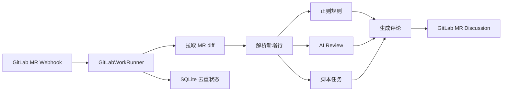
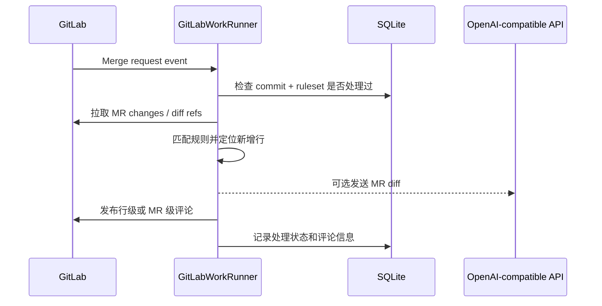

# GitLabWorkRunner

语言：**简体中文** | [English](README.en.md)

GitLabWorkRunner 是一个 Rust 编写的 GitLab Merge Request 自动 Review 服务。它通过 GitLab Webhook 获取 MR 变更，根据 `rules.toml` 执行规则、AI Review 或脚本任务，并把结果发布到 MR Discussion。

它不是 GitLab Runner 替代品，也不会自动执行目标仓库里的 CI 脚本；只会运行你在 `rules.toml` 中显式配置的检查。

## 工作原理



自动 Review 的一次请求大致是：



更多设计细节见 [docs/design.md](docs/design.md)。

## 支持能力

- GitLab Merge Request Webhook 自动触发 Review。
- 只对 MR diff 的新增行发布行级评论。
- `[[rules]]`：按路径和正则匹配新增行。
- `[[ai_reviews]]`：调用 OpenAI-compatible `POST /chat/completions` 做 AI Review。
- `[[script_tasks]]`：下载 MR head 快照并执行本地脚本。
- MR 评论手动触发脚本任务或 AI Review，例如 `@check-todo-tbd`、`@ai-review`。
- SQLite 去重，避免同一 commit 和规则集重复评论。

## 快速开始

准备配置文件：

```powershell
Copy-Item config.example.toml config.toml
Copy-Item rules.example.toml rules.toml
cargo run
```

Linux / macOS：

```bash
cp config.example.toml config.toml
cp rules.example.toml rules.toml
cargo run
```

在 GitLab 项目中添加 Webhook：

1. 进入 GitLab 项目，打开 `Settings` -> `Webhooks`。
2. `URL` 填写服务地址：

```text
http://<host>:8080/webhooks/gitlab
```

其中 `<host>` 是 GitLab 能访问到的 GitLabWorkRunner 地址。

3. `Secret token` 填写 `config.toml` 中 `[server].webhook_secret` 的值：

```toml
[server]
webhook_secret = "change-me"
```

4. 勾选 `Merge request events`。
5. 如果需要在 MR 评论里手动触发脚本任务或 AI Review，同时勾选 `Comments`。
6. 保存后可以使用 GitLab Webhook 页面里的 `Test` 功能发送测试事件。

Webhook 行为说明见 [docs/gitlab-webhook.md](docs/gitlab-webhook.md)。

## 构建

开发构建：

```bash
cargo build
```

发布/部署构建：

```bash
cargo build --release
```

构建产物：

```text
target/debug/gitlab-work-runner.exe      # Windows debug
target/release/gitlab-work-runner.exe    # Windows release
target/debug/gitlab-work-runner          # Linux / macOS debug
target/release/gitlab-work-runner        # Linux / macOS release
```

运行前仍需要准备 `config.toml` 和 `rules.toml`。

## 服务配置

`config.toml` 控制服务、GitLab、存储和规则文件：

```toml
[server]
bind = "0.0.0.0:8080"
webhook_secret = "change-me"

[gitlab]
base_url = "https://gitlab.example.com"
token = "<your-gitlab-token>"

[storage]
database_url = "sqlite://gitlab-work-runner.db"

[rules]
file = "rules.toml"

```

`[gitlab].token` 是服务调用 GitLab API 使用的 token，和 Webhook 里的 `Secret token` 不是同一个东西。建议使用 Project Access Token 或专用 Bot 用户 token，scope 使用 `api`，项目角色至少 `Developer`。它需要能读取 MR diff、下载仓库 archive，并发布 MR discussion。不要把包含真实 token 的 `config.toml` 提交到仓库。

## 规则配置

最小 `rules.toml` 示例：

```toml
[[rules]]
auto_enabled = true
id = "forbid-unwrap"
title = "避免直接 unwrap"
severity = "warning"
path = "**/*.rs"
pattern = "\\.unwrap\\(\\)"
message = "直接使用 unwrap 可能导致运行时 panic，建议改成错误传播或显式处理。"
```

`[[rules]]` 可以配置多条，每条通过 `id` 区分。`auto_enabled` 默认是 `true`；设置为 `false` 时，这条规则不会参与自动 Review。

AI Review 示例：

```toml
[[ai_reviews]]
auto_enabled = false
id = "ai-review"
title = "AI Review"
base_url = "https://api.openai.com/v1"
api_key = "<your-ai-api-key>"
model = "gpt-4.1-mini"
timeout_seconds = 60
request_timeout_seconds = 30
max_diff_bytes = 60000
second_pass_on_clean = false
batch_review = false
max_batch_diff_bytes = 30000
max_batches = 6
when_changed = ["**/*.rs", "**/*.toml"]
```

`auto_enabled` 默认是 `true`；设置为 `false` 时不会自动执行，但仍可以通过 MR 评论 `@ai-review` 手动触发。
`request_timeout_seconds` 是单次 AI API 请求的超时；不配置时默认使用 `timeout_seconds / 2`，用于保留一次失败重试机会。
`second_pass_on_clean` 默认是 `false`；设置为 `true` 时，第一次 AI Review 没有发现问题会再执行一次确认。
`batch_review` 默认是 `false`；设置为 `true` 时，会按完整文件 diff 分批调用 AI Review。`max_batch_diff_bytes` 控制单批 diff 字节上限，`max_batches` 控制最多请求批次数。

不要把包含真实 `api_key` 的 `rules.toml` 提交到仓库。

`@ai-review` 匹配的是 `[[ai_reviews]]` 里的 `id = "ai-review"`。`[[ai_reviews]]` 只是配置块类型，不是触发命令。

脚本任务示例：

```toml
[[script_tasks]]
auto_enabled = false
id = "check-todo-tbd"
title = "TODO/TBD marker check"
command = "python examples/scripts/check_todo_tbd.py"
timeout_seconds = 30
when_changed = ["**/*.rs"]
```

`auto_enabled` 默认是 `true`；设置为 `false` 时不会自动执行，但仍可以通过 MR 评论 `@check-todo-tbd` 手动触发。

`@check-todo-tbd` 匹配的是 `[[script_tasks]]` 里的 `id = "check-todo-tbd"`。

脚本会收到两个参数：

```text
<MR head source directory> <result.txt path>
```

当脚本返回 `exit 1` 时，服务读取 `result.txt`。推荐每行写成：

```text
src/config.rs:5: //TODO aa
```

## 手动触发

开启 GitLab Webhook 的 `Comments` 后，可以在 MR 评论中发送独立命令：

```text
@check-todo-tbd
@ai-review
```

手动触发不会使用自动 Review 的去重键；每条合法命令评论都会执行一次。

当前实现不会额外校验评论人的 GitLab 角色；只要用户能在 MR 评论，并且评论内容包含合法的 `@id`，服务就会执行对应手动任务。如果需要限制只有 Maintainer 或指定用户可以触发，需要在服务侧增加权限校验或 allowlist。

## 更多文档

- [docs/design.md](docs/design.md)：设计和模块边界。
- [docs/gitlab-webhook.md](docs/gitlab-webhook.md)：GitLab Webhook 配置和触发行为。
- [rules.example.toml](rules.example.toml)：完整规则示例。
- [examples/scripts/check_todo_tbd.py](examples/scripts/check_todo_tbd.py)：脚本任务示例。

## 许可证

MIT，见 [LICENSE](LICENSE)。
