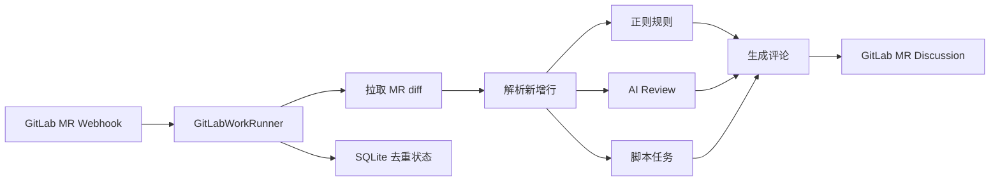
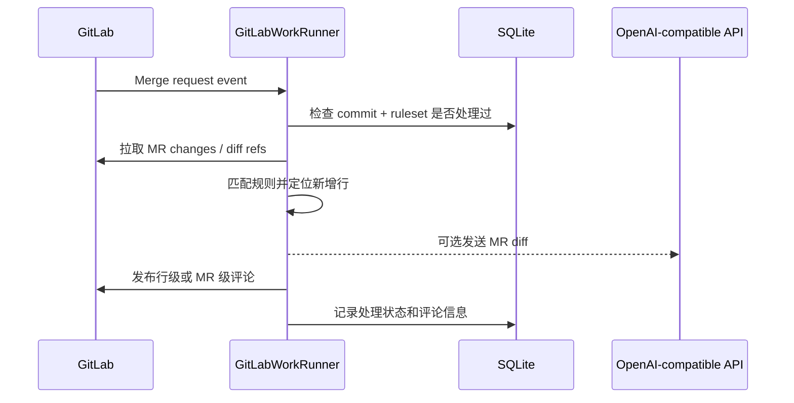

# GitLabWorkRunner

语言：**简体中文** | [English](README.en.md)

GitLabWorkRunner 是一个 Rust 编写的 GitLab Merge Request 自动 Review 服务。它通过 GitLab Webhook 获取 MR 变更，根据 `rules.toml` 执行规则、AI Review 或脚本任务，并把结果发布到 MR Discussion。

它不是 GitLab Runner 替代品，也不会自动执行目标仓库里的 CI 脚本；只会运行你在 `rules.toml` 中显式配置的检查。

## 工作原理



自动 Review 的一次请求大致是：



更多设计细节见 [docs/design.md](docs/design.md)。

## 支持能力

- GitLab Merge Request Webhook 自动触发 Review。
- 只对 MR diff 的新增行发布行级评论。
- `[[rules]]`：按路径和正则匹配新增行。
- `[[ai_reviews]]`：调用 OpenAI-compatible `POST /chat/completions` 做 AI Review。
- `[[script_tasks]]`：下载 MR head 快照并执行本地脚本。
- MR 评论手动触发脚本任务或 AI Review，例如 `@check-todo-tbd`、`@ai-review`。
- SQLite 去重，避免同一 commit 和规则集重复评论。

## 快速开始

准备配置文件：

```powershell
Copy-Item config.example.toml config.toml
Copy-Item rules.example.toml rules.toml
cargo run
```

Linux / macOS：

```bash
cp config.example.toml config.toml
cp rules.example.toml rules.toml
cargo run
```

在 GitLab 项目中添加 Webhook：

1. 进入 GitLab 项目，打开 `Settings` -> `Webhooks`。
2. `URL` 填写服务地址：

```text
http://<host>:8080/webhooks/gitlab
```

其中 `<host>` 是 GitLab 能访问到的 GitLabWorkRunner 地址。

3. `Secret token` 填写 `config.toml` 中 `[server].webhook_secret` 的值：

```toml
[server]
webhook_secret = "change-me"
```

4. 勾选 `Merge request events`。
5. 如果需要在 MR 评论里手动触发脚本任务或 AI Review，同时勾选 `Comments`。
6. 保存后可以使用 GitLab Webhook 页面里的 `Test` 功能发送测试事件。

Webhook 行为说明见 [docs/gitlab-webhook.md](docs/gitlab-webhook.md)。

## 构建

开发构建：

```bash
cargo build
```

发布/部署构建：

```bash
cargo build --release
```

构建产物：

```text
target/debug/gitlab-work-runner.exe      # Windows debug
target/release/gitlab-work-runner.exe    # Windows release
target/debug/gitlab-work-runner          # Linux / macOS debug
target/release/gitlab-work-runner        # Linux / macOS release
```

运行前仍需要准备 `config.toml` 和 `rules.toml`。

## 服务配置

`config.toml` 控制服务、GitLab、存储和规则文件：

```toml
[server]
bind = "0.0.0.0:8080"
webhook_secret = "change-me"

[gitlab]
base_url = "https://gitlab.example.com"
token = "<your-gitlab-token>"

[storage]
database_url = "sqlite://gitlab-work-runner.db"

[rules]
file = "rules.toml"

```

`[gitlab].token` 是服务调用 GitLab API 使用的 token，和 Webhook 里的 `Secret token` 不是同一个东西。建议使用 Project Access Token 或专用 Bot 用户 token，scope 使用 `api`，项目角色至少 `Developer`。它需要能读取 MR diff、下载仓库 archive，并发布 MR discussion。不要把包含真实 token 的 `config.toml` 提交到仓库。

## 规则配置

最小 `rules.toml` 示例：

```toml
[[rules]]
auto_enabled = true
id = "forbid-unwrap"
title = "避免直接 unwrap"
severity = "warning"
path = "**/*.rs"
pattern = "\\.unwrap\\(\\)"
message = "直接使用 unwrap 可能导致运行时 panic，建议改成错误传播或显式处理。"
```

`[[rules]]` 可以配置多条，每条通过 `id` 区分。`auto_enabled` 默认是 `true`；设置为 `false` 时，这条规则不会参与自动 Review。

AI Review 示例：

```toml
[ai_review]
# 可选：全局 AI Review prompt 配置，所有 [[ai_reviews]] 共用。
# system_prompt = "You are a careful code reviewer. Return only high-confidence bugs."
extra_instructions = """
重点关注编译错误、运行时错误、资源生命周期、线程安全和安全漏洞。
不要报告风格建议、命名建议或不确定的问题。
"""
max_tool_calls = 8
max_tool_result_bytes = 60000

[ai_review.context_tools]
read_file = false
search_code = false
list_files = false

[[ai_reviews]]
auto_enabled = false
id = "ai-review"
title = "AI Review"
base_url = "https://api.openai.com/v1"
api_key = "<your-ai-api-key>"
model = "gpt-4.1-mini"
timeout_seconds = 900
request_timeout_seconds = 180
max_diff_bytes = 60000
second_pass_on_clean = false
batch_review = true
max_batch_diff_bytes = 15000
max_batches = 10
when_changed = ["**/*.rs", "**/*.toml", "**/*.c", "**/*.cc", "**/*.cpp", "**/*.h", "**/*.hpp"]
```

`auto_enabled` 默认是 `true`；设置为 `false` 时不会自动执行，但仍可以通过 MR 评论 `@ai-review` 手动触发。
`[ai_review]` 是全局 AI Review prompt 配置：`system_prompt` 可以替换内置 system prompt，`extra_instructions` 会追加到用户 prompt。缺省时使用内置 prompt，不需要配置。
`[ai_review.context_tools]` 是进程内只读上下文工具配置，默认全部关闭。开启后，服务会下载 MR head archive，让模型可以通过 tool call 请求 `read_file`、`search_code` 或 `list_files`；runner 只返回仓库目录内的文本内容，不执行 shell，也不会读取 `.env` 或 `.git`。
`max_tool_calls` 默认是 `8`，`max_tool_result_bytes` 默认是 `60000`。如果 context tools 都关闭，不会额外下载 archive，也不会增加中间 AI 请求。
`request_timeout_seconds` 是单次 AI API 请求的超时；不配置时默认使用 `timeout_seconds / 2`，用于保留一次失败重试机会。
`second_pass_on_clean` 默认是 `false`；设置为 `true` 时，第一次 AI Review 没有发现问题会再执行一次确认。
AI Review 默认请求 Chat Completions `tool_calls` 结构化输出，并从 `submit_review_findings` 的 arguments 解析 findings；如果响应没有 tool call，会回退解析 `content` 中的 JSON。内置 context tools 不需要 MCP，也不会调用外部服务。
`batch_review` 默认是 `false`；设置为 `true` 时，会按完整文件 diff 分批调用 AI Review。`max_batch_diff_bytes` 控制单批 diff 字节上限，`max_batches` 控制最多请求批次数。
上面的示例是面向较大 MR 的推荐配置；代码缺省值仍保持保守，不写 `batch_review` 时不会自动分批，也不会增加额外 AI 请求。

内置 context tools 说明：

`read_file(path)` 读取 MR head checkout 中的一个 UTF-8 文本文件。

参数：

```json
{ "path": "src/lib.rs" }
```

返回：

```json
{
  "ok": true,
  "path": "src/lib.rs",
  "content": "file content...",
  "truncated": false
}
```

`search_code(query, glob?)` 在 MR head checkout 中搜索文本。`query` 是普通子串匹配，不是正则；`glob` 可选，用于限制文件范围。

参数：

```json
{ "query": "parse_config", "glob": "src/**/*.rs" }
```

返回：

```json
{
  "ok": true,
  "matches": [
    {
      "path": "src/config.rs",
      "line": 42,
      "before": "impl Config {",
      "text": "fn parse_config(...)",
      "after": "}"
    }
  ],
  "truncated": false
}
```

`list_files(glob?)` 列出 MR head checkout 中的文件。`glob` 可选，用于限制文件范围。

参数：

```json
{ "glob": "src/**/*.rs" }
```

返回：

```json
{
  "ok": true,
  "files": ["src/lib.rs", "src/config.rs"],
  "truncated": false
}
```

工具失败时统一返回：

```json
{ "ok": false, "error": "error message" }
```

所有工具都只接受仓库内相对路径；绝对路径、`..` 越界路径、`.env` 和 `.git` 会被拒绝或跳过。`read_file` 最多读取 `max_tool_result_bytes` 和 1 MiB 两者中的较小值，并按 UTF-8 字符边界截断。`search_code` 和 `list_files` 会跳过常见依赖/构建目录与 lock 文件，例如 `node_modules/`、`target/`、`dist/`、`vendor/`、`Cargo.lock`、`package-lock.json`。单个工具结果会按 `max_tool_result_bytes` 截断；`search_code` 最多返回 50 条匹配、每个文件最多 5 条，并跳过大于 1 MiB 的文件；`list_files` 最多返回 200 个文件。

不要把包含真实 `api_key` 的 `rules.toml` 提交到仓库。

`@ai-review` 匹配的是 `[[ai_reviews]]` 里的 `id = "ai-review"`。`[[ai_reviews]]` 只是配置块类型，不是触发命令。

脚本任务示例：

```toml
[[script_tasks]]
auto_enabled = false
id = "check-todo-tbd"
title = "TODO/TBD marker check"
command = "python examples/scripts/check_todo_tbd.py"
timeout_seconds = 30
when_changed = ["**/*.rs"]
```

`auto_enabled` 默认是 `true`；设置为 `false` 时不会自动执行，但仍可以通过 MR 评论 `@check-todo-tbd` 手动触发。

`@check-todo-tbd` 匹配的是 `[[script_tasks]]` 里的 `id = "check-todo-tbd"`。

脚本会收到两个参数：

```text
<MR head source directory> <result.txt path>
```

当脚本返回 `exit 1` 时，服务读取 `result.txt`。推荐每行写成：

```text
src/config.rs:5: //TODO aa
```

## 手动触发

开启 GitLab Webhook 的 `Comments` 后，可以在 MR 评论中发送独立命令：

```text
@check-todo-tbd
@ai-review
```

手动触发不会使用自动 Review 的去重键；每条合法命令评论都会执行一次。

当前实现不会额外校验评论人的 GitLab 角色；只要用户能在 MR 评论，并且评论内容包含合法的 `@id`，服务就会执行对应手动任务。如果需要限制只有 Maintainer 或指定用户可以触发，需要在服务侧增加权限校验或 allowlist。

## 更多文档

- [docs/design.md](docs/design.md)：设计和模块边界。
- [docs/gitlab-webhook.md](docs/gitlab-webhook.md)：GitLab Webhook 配置和触发行为。
- [rules.example.toml](rules.example.toml)：完整规则示例。
- [examples/scripts/check_todo_tbd.py](examples/scripts/check_todo_tbd.py)：脚本任务示例。

## 许可证

MIT，见 [LICENSE](LICENSE)。
